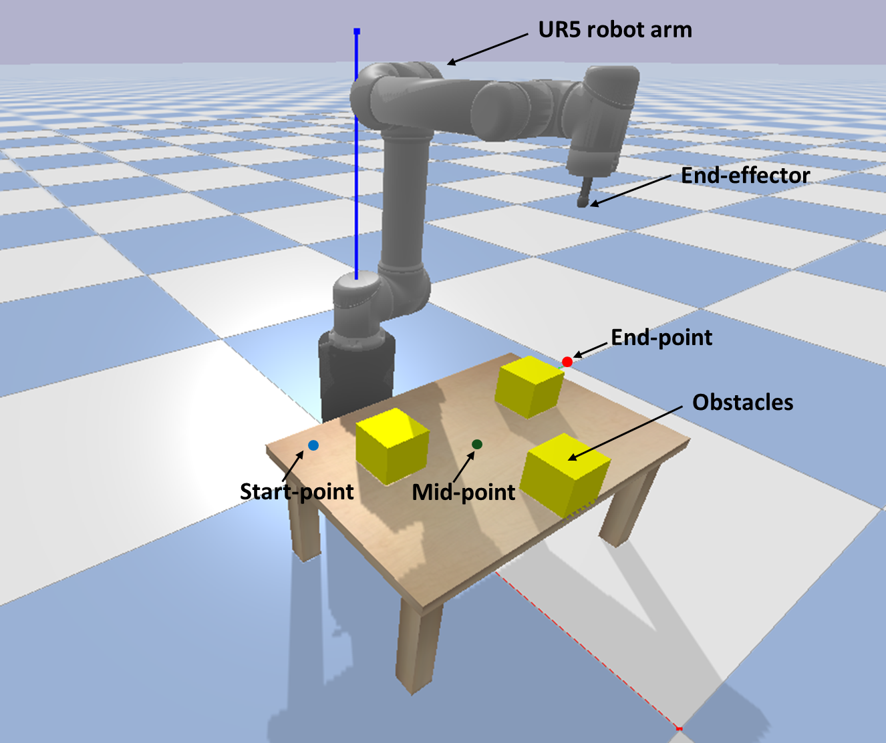

## Assignment 1: Path Planning of a Robotic Arm with Obstacle Avoidance  

## Overview:  
The goal of this assignment is to implement sampling-based motion planning for a robotic manipulator in simulation. In particular, you will implement Rapidly-exploring Random Trees (RRT) and its bidirectional variant BiRRT, and use them to plan collision-free paths.

## Simulation Environment  

The simulation environment is PyBullet, which provides realistic collision checking and kinematics utilities. 

  

### Exercises  
The assignment has 6 exercises:

* **Part 1**: RRT in Joint Space
* **Part 2**: BiRRT in Joint space
* **Part 3**: BiRRT in Task space
* **Part 4**: BiRRT in Task space
* **Part 5**: Analysis and Comparison
* **Part 6**: Evaluation on unseen environment
	
For **parts 1-4**, you are expected to deliver the following:
* Build the tree and visualize it. 
* Find and visualize the path
* Control the robot to move to the target objects following the found path. Show the following trajectory of the robot’s end-effector using black lines.

For **part 5**, prepare a report comparing part 1-4. You can use any metrics to compare based on your understanding. Some metrics are provided here for reference: Computation time to find a path, Path length/smoothness, Success rate over multiple runs, Smoothness of end-effector trajectory

For **Part 6**, your planner will be tested on a different environment, where obstacle positions will be varied. The goal is to evaluate adaptability and robustness of your implementation.

#### Extra Credits

- Implement a path smoothing algorithm on the found path with RRT/BiRRT
- Implement RRT* (optimal variant of RRT) and compare with RRT/BiRRT
- Implement and control a robot using a trajectory planning algorithm with velocity/acceleration limits
 
## Setup Instructions  

### Requirements  
- Python 3.8+  
- [PyBullet](https://pybullet.org): Install using `pip install pybullet`
- NumPy 

## Acknowledgement
Thanks [John Rebeiro](https://github.com/johnreb20) for his help in preparing this assignment!
