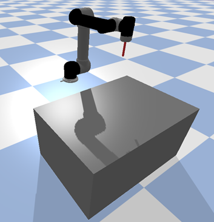

## Assignment 1: Force control of a robotic arm

## Overview:  
This assignment focuses on implementing and analyzing force control strategies for robotic manipulators. You will explore admittance and impedance control schemes.

## Simulation Environment  

The simulation environment is PyBullet, which provides realistic kinematics and dynamic utilities for a robotic system. 

  

### Exercises  
The assignment has 6 exercises:

* **Part 1**: Admittance control for static interaction
* **Part 2**: Admittance control for dynamic interaction
* **Part 3**: Impedance control for static interaction
* **Part 4**: Impedance control for dynamic interaction
* **Part 5**: Analysis and Comparison
* **Part 6**: Evaluation on unseen environment
	
***Static Interaction***: The end-effector interacts with the environment at a fixed point (e.g., maintaining contact force on a stationary surface). 

***Dynamic Interaction***: The end-effector moves along a continuous path (e.g., circular motion) while maintaining a desired contact force with the environment. 	

For **parts 1-4**, you are expected to deliver the following:
* Code implementation for both the controllers and the interactions
* Plots of motion trajectories and contact forces (real-time plotting preferred)

For **part 5**, prepare a comparative analysis between admittance and impedance control schemes. Discuss their advantages, limitations, and suitable application domains. Additionally, you can also use any metrics to compare them based on your understanding. Some are provided here for reference: Force tracking error, Settling time, Motion smoothness

For **part 6**, your planner will be tested on a different environment, where surface topology  will be varied. The goal is to evaluate adaptability and robustness of your implementation.

#### Extra Credits
* Extend your implementation to handle interactions with non-planar surfaces.
* Implement online adaptation of virtual mass, damping, or stiffness based on contact conditions.
 
## Setup Instructions  

### Requirements  
- Python 3.8+  
- [PyBullet](https://pybullet.org): Install using `pip install pybullet`
- NumPy 
